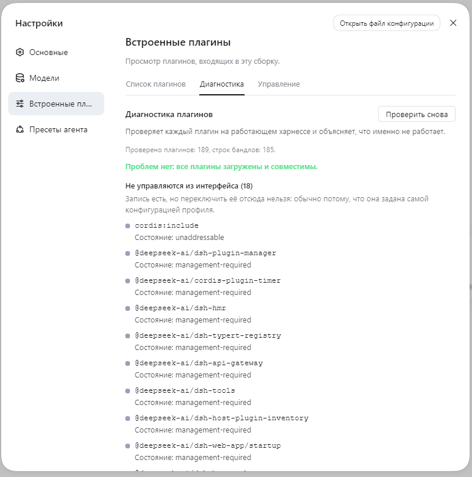

# @ragnoryok1/dsh-plugin-doctor


[Русский](README.md) | **中文** | [English](README.en.md)

一个面向 [DeepSeek Harness](https://github.com/deepseek-ai/deepseek-harness) Web GUI（`dsh`）的诊断面板。

## 检查内容

| 分类 | 含义 |
|---|---|
| **加载失败** | 插件在启动时报告了错误，会显示它自己给出的消息。 |
| **已声明但未运行** | 某个包声明了这一行，但没有任何运行中的条目承载它——这正是更新失败后留下的痕迹。 |
| **无法在此管理** | 条目存在，但不能在这里切换。会显示具体原因：`management-required`、`unaddressable` 等。 |
| **已禁用** | 被有意关闭。 |
| **版本警告** | 不致命，但在下次更新前值得一读。 |

只有错误才算作问题。参考类分类始终可见，但绝不会让一个健康的配置档看起来像是坏掉了。

## 界面外观



## 安装

```
dsh plugin --profile web add @ragnoryok1/dsh-plugin-doctor
```

然后打开 **Settings → Built-in plugins → Diagnostics**。

## 为什么它能经受住多次更新

本插件从不读取其他包的文件或内部实现。它展示的一切都来自**受支持的服务**：插件管理器通过 Remote 协议（`remote.pluginManager`）上报状态，返回结果再从 `{ ok, value }` 信封中解包出来。

由此衍生出两个特性，而这两点都很容易做错：

- **“未发现问题”总是附带检查数量**——否则它与“这次检查什么都没看到”无法区分；
- **参考信息不是问题**：配置档自身拥有的内置模块属于正常情况，而不是故障。

## 如何验证

像“能找出损坏的插件”这样的说法，如果没有真正弄坏一个插件就毫无价值，因此我们在一台实际运行的 harness 上，用一个刻意弄坏的插件做了验证：`fixtures/canary/` 里存放着一个 `apply()` 始终抛异常的 fixture。

| 配置档状态 | 面板显示的内容 |
|---|---|
| 已安装 canary | **“发现 1 个问题”** → “已声明但未运行 (1)：`doctor-canary`”，并附带模块名和建议 |
| 已移除 canary | **“未发现问题。所有插件均已加载且兼容。”** |

复现步骤见 [fixtures/canary/README.md](fixtures/canary/README.md)。

有一个细节值得了解：在**宿主端**失败的行永远不会进入运行中插件列表，因此已经没有谁还能承载 `meta.error`——正是包级条目检查抓到了它。两种检查都必不可少，实践也证实了这一点。

## 两个部分：面板与磁盘扫描

面板通过受支持的服务读取插件状态——但这些服务运行在浏览器里，**看不到文件系统**。而那些我们总要手动一点点排查的故障恰恰存在于磁盘上，所以由另一个脚本来报告它们：

```
node bin/doctor-scan.mjs
# or, when the package is installed on its own: npx dsh-doctor
```

| 查找对象 | 为什么重要 |
|---|---|
| `*.parked` 目录 | 被搁置的插件副本——更新时绕过“重命名被占用”留下的痕迹 |
| `_tmp_*` 目录 | 安装失败后的残留；正是它让更新以 `EPERM` 失败 |
| 损坏的 `file:` 链接 | 配置档指向了一个已经不在的文件：安装还没开始就会以 `ENOENT` 失败 |

**在真实残留物上验证过。** 该脚本先在干净的配置档上运行，再在刻意制造了残留文件的配置档上运行（两类残留都被找到），然后再次在干净的配置档上运行——没有任何发现。期间它还发现了一个真实的 `*.parked` 目录，是某次插件更新中为绕过 `EPERM` 而遗留在配置档里的；那个目录已被删除。

**为什么残留文件没有出现在面板里。** 要在界面中展示它们，就需要本插件自己的 remote 服务，而 `ctx.remote.*` 下的名称是由 harness 构建流水线**生成**的。生成器（`@deepseek-ai/dsh-typert-generator`）已经发布，所以这条路是存在的——但那是另一项工作，本文档并不宣称它已经完成。

## 它不做什么

- **不做任何修复**：它只负责报告；
- **不向任何地方发送数据**：一切都在本地计算。

## 为什么 peer 范围这么长

`peerDependencies` 里不是一个短范围，而是九条带显式预发布标签的分支。这不是装饰：node-semver 只有在范围中存在**同一个** `major.minor.patch` 元组、且自身带预发布标签的比较符时，才允许预发布版本通过。所以看起来很宽的 `>=0.1.0-rc.2 <0.3.0` **既匹配不到** `0.1.7-alpha.2`，**也匹配不到** `0.2.1-alpha.1`，用户会撞上 `ERESOLVE`。已用 npm 本身验证：短范围只解析出 `0.1.0-rc.2 … 0.1.0-rc.8`，长范围覆盖我们需要的每个版本。

## 构建

```
npm install
npm run build     # tsdown -> lib/index.js (host half) + lib/client.js (client bundle)
npm pack
```

`lib/client.js` 以 `dsh` 客户端加载器能够识别的格式构建（`__ModuleLoader__.load`），并导出 `inject`/`apply`。React 与 harness 相关包保持为外部依赖，由加载器负责解析。

## 目录结构

- `src/client/index.ts` —— 面板、各项检查以及标签页注册；
- `src/client/locales.ts` —— 本插件自身界面所用的 `ru`、`zh` 和 `en` 词典；
- `src/index.ts` —— 空的宿主端部分（它的作用是提供一个可加载的 node 入口）；
- `cordis.patch.yml` —— 配置档补丁（为 `plugin-doctor` 客户端行添加 `- insert:`）；
- `bin/doctor-scan.mjs` —— 磁盘扫描（残留文件与损坏链接）；
- `fixtures/canary/` —— 用于验证面板的 canary fixture。

## 许可证

MIT。这是一个社区包，**与 DeepSeek 无隶属关系**。
